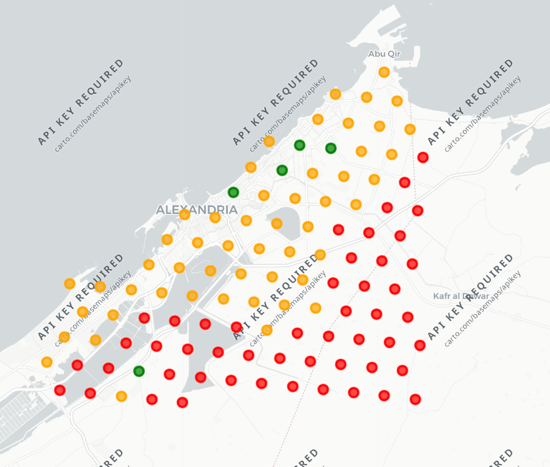

# Alexandria Coastal Flood Risk & Emergency Response API

Spatial data engineering project that pre-computes a flood vulnerability
index across a hexagonal grid covering coastal Alexandria, Egypt, and
serves it through a fast lookup API — designed around the emergency
dispatch use case (an ambulance transmits GPS coordinates and needs an
immediate risk assessment for that location).



## Problem

Alexandria is a low-lying coastal city vulnerable to winter storm surges
and flooding. During an emergency, real-time spatial intersection queries
against complex polygon boundaries are too slow for dispatch decisions.
This project pre-computes risk per grid cell offline, so a live lookup at
request time is just a dictionary lookup by cell ID.

## Data

- **Uber H3 hexagonal grid** (Resolution 7, ~5.16 km² per cell), restricted
  to land cells only, covering the coastal strip of Alexandria (107 cells).
- **Elevation** for each cell centroid, from the free Open-Meteo Elevation
  API (Copernicus DEM GLO-90, 90m resolution), fetched in batches of 100
  points to respect the API's rate limits.
- **94 real hospitals/clinics**, fetched from OpenStreetMap via OSMnx,
  reduced to centroids using a metric CRS (EPSG:32636).
- **Natural Earth land polygons**, used to exclude sea cells from the grid
  (see Methodology below).

## Methodology

1. **Coastal bounding box, not administrative boundary**: uses a manual
   bounding box instead of OSM's boundary for "Alexandria, Egypt", which
   returns the full governorate extending ~137km south into the desert.
   The bounding box matches the actual urban coastal strip.

2. **Grid resolution trade-off**: started at H3 resolution 8 (~4,800
   cells), which required ~49 batched Open-Meteo API calls and repeatedly
   hit rate limits. Switched to resolution 7 to keep the pipeline reliably
   within free-tier limits.

3. **Land-only grid (an issue discovered during review)**: a rectangular
   bounding box over a coastal city inevitably includes open sea to the
   northwest. An earlier version of this project did not filter these
   out, which produced hexagons sitting entirely in the Mediterranean
   that were scored as flood-risk zones — a meaningless result, since
   there's no land there to flood. This was caught by visually inspecting
   the result map (colored dots appeared offshore in open water). A first
   fix attempt tried to build a land polygon from OSM's raw coastline
   data, but the crowd-sourced coastline segments had gaps and couldn't
   be merged into one continuous line. The working fix instead clips
   against Natural Earth's authoritative land dataset and keeps only H3
   cells whose centroid falls on land — reducing the grid from 184 to
   107 cells.

4. **Distance calculation**: nearest-hospital distance per cell computed
   in PostGIS using `ST_Distance` after projecting to EPSG:32636 (UTM
   Zone 36N).

5. **Composite vulnerability score**: originally modeled as
   `0.7 × elevation_risk + 0.3 × distance_risk` with fixed thresholds
   (0m/15m for elevation, 5000m for distance). This produced a degenerate
   result — most cells classified "High" — because the vast majority of
   the coastal strip sits at or below sea level, so a fixed 0m/15m cutoff
   couldn't discriminate between cells. The fix: both factors are min-max
   normalized against the actual (land-only) data distribution rather
   than using externally-assumed thresholds, and the weighting was
   rebalanced to 50/50 since elevation carries much less discriminating
   power in this flat coastal city than a generic 70/30 split would
   assume.

## Architecture

```
OpenStreetMap (OSMnx)      Open-Meteo Elevation API      Natural Earth
   │ hospitals                 │ elevation per cell         │ land polygons
   ▼                           ▼                            ▼
                    H3 grid generation (land-only cells)
                                │
                                ▼
        PostGIS (PostgreSQL)
   - hex_grid, hospitals, hex_distances (ST_Distance in EPSG:32636)
                │
                ▼
        Python / Pandas
   - Min-max normalized composite vulnerability score
   - Exported to alexandria_risk_scores.csv
                │
                ▼
        FastAPI (loads CSV into memory at startup)
   - GET /api/v1/flood-safety/by-location?lat=..&lon=..
   - GET /api/v1/flood-safety/{h3_index}
```

## API

**By GPS coordinates** (e.g. an ambulance's live location):
```
GET /api/v1/flood-safety/by-location?lat=31.2&lon=29.9
```
Converts `(lat, lon)` to an H3 cell index in memory (`h3.latlng_to_cell`)
and returns the pre-computed risk profile for that cell.

**By H3 index directly** (for dispatch systems that already track cells):
```
GET /api/v1/flood-safety/{h3_index}
```

Example response:
```json
{
  "h3_index": "873e66d13ffffff",
  "elevation_m": -1.0,
  "dist_to_hospital_m": 15236.55,
  "vulnerability_score": 95.95,
  "risk_category": "High"
}
```

## Setup

```bash
pip install -r requirements.txt
```

Create a `.env` file (see `.env.example`) with your PostgreSQL credentials,
then create the `alexandria_gis` database with the PostGIS extension
enabled:
```sql
CREATE EXTENSION IF NOT EXISTS postgis;
```

Run the pipeline scripts in order:
```bash
python scripts/generate_alexandria_h3_grid.py
python scripts/build_alexandria_risk_dataset.py
python -m uvicorn scripts.alexandria_emergency_api:app --reload
```

## Known Limitations

- Elevation is a static snapshot (Copernicus DEM, 90m resolution) — a
  reasonable proxy for relative flood susceptibility, not a real-time or
  high-precision flood model.
- No historical flood event data was available for validation; the risk
  index is a structural proxy (elevation + emergency service access), not
  a calibrated hydrological model.
- Hospital data reflects what's tagged in OpenStreetMap at the time of
  fetching, which may miss some smaller clinics.
- The land/sea filter uses cell-centroid containment, so a hexagon whose
  centroid is on land but which partially overlaps water (or vice versa)
  is not split at the coastline.

## Tech Stack

Python (GeoPandas, OSMnx, H3, FastAPI, Pandas/scikit-learn), PostgreSQL +
PostGIS, SQLAlchemy.
